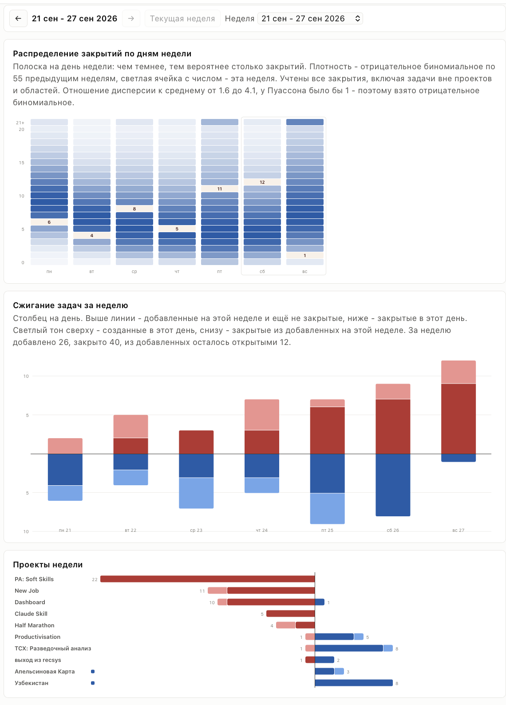

# things3-dash

A weekly dashboard for [Things 3](https://culturedcode.com/things/) on macOS.
It reads the local Things database (read-only) and builds a single
self-contained HTML page: data embedded, no external requests, works offline.

The page interface is in Russian.



## What the page shows

Navigation by week (Monday to Sunday), from the first week with data up to the
current one.

1. **Closures by weekday.** One strip per weekday: the darker the cell, the more
   likely that many closures on that day. The distribution is a negative
   binomial fitted on up to 55 previous full weeks. The highlighted cell is the
   selected week. All closures count, including tasks outside projects and areas.
2. **Balance by area.** A wheel with one spoke per area: how many tasks were
   closed in each area during the week. The outer line shows how many tasks
   were touched: created, edited or closed, tasks still in the Inbox left out.
   It is collected from the week the feature was first run; earlier weeks show
   closures only.
3. **Added and done in the week.** One bar: tasks added this week and still
   open, tasks added this week and closed, tasks added earlier and closed.
4. **Projects of the week.** One row per active project: closed tasks to the
   right, open tasks to the left, each split into "created earlier" and
   "created this week". A project name is a link that opens the project
   in Things. A project in which no task was closed for two weeks or more is
   marked with the number of such weeks in a row.

The **Year** tab shows the projects of a year along a strip of weeks, with
navigation by year. A cell of the strip is one week: the darker it is, the more
tasks were closed in it. Hovering a cell gives the dates of the week and the
tasks closed and added in it; while a project is pinned, the tasks of that
project. A double click on a cell opens that week on the week tab.

A project is named where the work on it was. Above the strip are the projects
whose first task was completed in the week, under it the closed projects whose
last task was completed in it, each group on a dashed line from the week. A
project without a completed task is named at its creation and at its closing,
in grey. Above the strip only the projects that do not end within the year are
drawn: one that ends in it is named under the strip, and its name above comes up
with the project. A canceled project and a project that lasted less than two
days are not shown. The "show all" switch of
the card names every project, both where it starts and where it ends. Copies of
repeating projects are never shown. An open project scheduled in Things to
start on a day still ahead stands over the week of that day only, as a hollow
dot and a name in italics; the day is called a return if a task of the project
was completed.

A double click on a name opens the project in Things. Hovering a name fades
everything but the project: the weeks it lived through stay bright, from its
creation to its closing, or to today for an open one, and the length of the
project is written over them. The date of the task is written beside each name.
The weeks of the creation and of the closing, where they are not the weeks of
the names, are ticks across the strip with their dates over it, on both sides of the length; a date outside the shown
year is given with an arrow at that edge of the strip. An open project has no
name for its end: its second tick is the week of its last completed task. A
click on a name pins the project: it stays lit until its name is clicked again,
another name or the chart beside them.

Under the strip are the totals of the year in one line: tasks added, closed and
canceled, and projects added, closed and canceled. A project is added on the day
it was created and closed on the day it was closed, wherever its names stand.

## History

Past weeks come from a local history, `history.sqlite`, not from the current
state of Things. Every complete week is frozen once, at the first refresh after
it ends, and never changes after that; the running week is computed anew on
every refresh. Areas, projects and tasks deleted in Things later stay in the
weeks they belong to, under their last known names. Touched tasks are noted at
every refresh, because Things keeps only the last modification date of a task:
the more often you refresh, the more complete this number is. On the first run the
history is filled from the current database. The schema and its rules are in
[docs/history-schema.md](docs/history-schema.md).

## Requirements

- macOS with the Things 3 Mac app and its local database
- `bash` (ships with macOS)
- Python 3.7 or newer with SQLite 3.24 or newer, standard library only

## Install

```sh
git clone https://github.com/newrlan/things3-dash.git
cd things3-dash
```

No dependencies to install.

## Usage

### Build the page once

```sh
./refresh.sh
open week.html
```

`refresh.sh` runs `build_week.py`, which reads the Things database, updates
`history.sqlite`, freezes the weeks that have ended and builds `week.html` from
`week.template.html`. It refuses a read with no to-dos, or with less than half
of the to-dos of the previous one, so that a failed read never gets frozen into
the history.

To see fresh data, run `./refresh.sh` again and reload the page.

### Refresh from the browser

```sh
python3 serve.py          # default port 8765
python3 serve.py 9000     # another port
```

Open http://127.0.0.1:8765/week.html. Served over http, the page shows the
refresh data button: it asks `serve.py` to run
`refresh.sh` and reloads the page when done. The button is hidden when the page
is opened as a local file.

## How the data is read

- The database is found at
  `~/Library/Group Containers/JLMPQHK86H.com.culturedcode.ThingsMac/ThingsData-*/Things Database.thingsdatabase/main.sqlite`.
  If there are several `ThingsData-*` directories, the most recently modified
  one is used.
- It is opened read-only (`mode=ro`). Nothing is copied or written into the
  Things container, and no intermediate files are kept.
- If macOS refuses access to the database, allow your terminal app access in
  System Settings > Privacy & Security.

## Privacy

- To-do titles are not read. Only project, heading and area titles leave
  the database; project and area titles are stored in `history.sqlite` and
  embedded in `week.html`.
- `history.sqlite` keeps the identifiers (not the titles) of the to-dos touched
  in the running week; they are removed when the week is frozen.
- `week.html` and `history.sqlite` hold your personal data and are listed in
  `.gitignore`. Do not publish them.
- `history.sqlite` is the only copy of past weeks once Things has forgotten
  them: keep it in your backups.

## What is counted

- Trashed items are excluded.
- Canceled tasks count as closed, the same as completed ones: cancelling a task
  takes effort too. The history keeps them apart.
- A task belongs to its own area, else to its project's area. If an area is
  deleted in Things, its projects keep it as their last known area; to-dos that
  sat in the area outside any project fall under "Без области" in the weeks not
  frozen yet.
- Canceled projects and projects in Someday are not shown as rows in "Projects
  of the week"; their tasks still count in the other charts. Someday is taken
  at the moment a week is frozen; for the weeks filled on the first run it is
  the state on that day.
- A task whose closing date is earlier than its creation date is treated as
  closed on its creation day.

## Known limitations

- Repeating to-dos are not filtered out.
- The build relies on the Things database schema (`TMTask`, `TMArea`). A Things
  update that changes the schema can break it; `build_week.py` then stops with
  the SQLite error naming the missing table or column, before anything is
  written.
- `serve.py` listens on `127.0.0.1` only, but `POST /refresh` has no protection
  against requests sent by other web pages open in the same browser, and the
  server gives out every file in the project directory, including
  `history.sqlite`. Run it only while you need it.

## Files

| File | Purpose |
|---|---|
| `build_week.py` | Reads the Things database, updates the history and builds `week.html` from it and the template |
| `week.template.html` | Page template: styles, charts, the `/*__DATA__*/` placeholder |
| `refresh.sh` | Runs the build |
| `serve.py` | Local http server with the refresh endpoint |
| `docs/history-schema.md` | Schema and rules of `history.sqlite` |

## License

[MIT](LICENSE)
