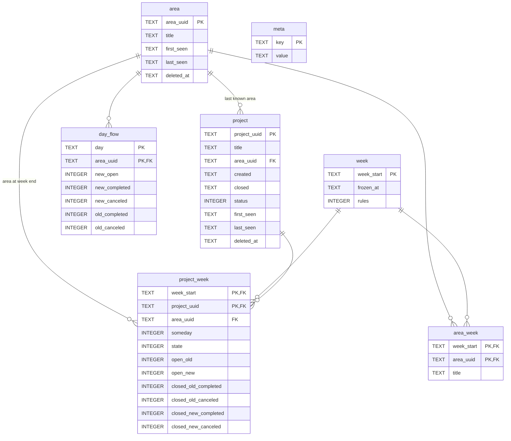

# Накопительная история: схема данных

## Зачем

Дашборд строится из текущего состояния базы Things. Всё, что из неё исчезло (удалённые области, проекты, задачи после очистки корзины), пропадает и из статистики за прошлые недели. Накопительная история фиксирует недельную статистику до того, как данные исчезнут.

## Принципы

- Полные недели замораживаются. При первом обновлении после окончания недели её строки пишутся один раз и больше не меняются. Текущая неделя всегда считается заново из базы Things.
- Первое заполнение: все прошлые недели из текущей базы.
- Области и проекты хранятся с последним известным названием; удаление в Things их не стирает из памяти дашборда.
- Для каждой замороженной недели фиксируется список областей с их названиями на момент заморозки: колесо прошлой недели показывает названия «на дату».
- Проект приписывается к последней известной области. Если область удалили, задачи её проектов, в том числе закрытые уже после удаления, засчитываются удалённой области, а не «Без области». Задача относится к своей области, если она есть, иначе к области своего проекта.

## Схема



`day_flow` связана с неделей не внешним ключом, а датой: день относится к неделе, в которую попадает.

## Справочники

```sql
-- Area uuid '' is the "no area" bucket: tasks without a project and an area,
-- and tasks in projects without an area.
CREATE TABLE area (
  area_uuid   TEXT PRIMARY KEY,
  title       TEXT NOT NULL,      -- last known title
  first_seen  TEXT NOT NULL,      -- date of the first export that had it
  last_seen   TEXT NOT NULL,      -- date of the last export that had it
  deleted_at  TEXT                -- first export where it was gone, NULL if alive
);

CREATE TABLE project (
  project_uuid TEXT PRIMARY KEY,
  title        TEXT NOT NULL,
  area_uuid    TEXT NOT NULL REFERENCES area,  -- last known area, see "Последняя известная область"
  created      TEXT NOT NULL,     -- creation date
  closed       TEXT,              -- completion/cancel date, NULL if open
  status       INTEGER NOT NULL,  -- 0 open, 2 canceled, 3 completed (last known)
  first_seen   TEXT NOT NULL,
  last_seen    TEXT NOT NULL,
  deleted_at   TEXT
);

-- Service values; 'export_todos' is the number of to-dos in the last accepted
-- export, used to refuse a broken one.
CREATE TABLE meta (
  key    TEXT PRIMARY KEY,
  value  TEXT NOT NULL
);

-- One row per frozen week; a week without a row here is computed live.
CREATE TABLE week (
  week_start  TEXT PRIMARY KEY,   -- Monday, ISO date
  frozen_at   TEXT NOT NULL,      -- when the rows of this week were written
  rules       INTEGER NOT NULL    -- version of the counting rules used
);
```

### Последняя известная область

При удалении области Things переводит её проекты и задачи в «без области» и очищает у них поле `area`: ссылки на удалённую область в базе не остаётся. Принадлежность к области может сохранить только история, на обновлениях до удаления.

Правило обновления `project.area_uuid` при каждом обновлении:
- у записи есть область - записать её (так учитывается и перенос между областями);
- области нет, а прежняя область пропала из этой же выгрузки (удалена) - оставить
  прежнее значение;
- области нет, а прежняя область по-прежнему существует (запись вывели из области
  вручную) - записать «Без области» (`''`).

Задача относится к своей области, если она есть, иначе к `project.area_uuid` своего проекта.

Ограничения:
- задачи без проекта, лежавшие прямо в удалённой области, переходят в «Без области» во всех ещё не замороженных неделях: их область история не хранит;
- проекты из областей, удалённых до запуска истории, навсегда остаются в «Без области»;
- если область создали и удалили между двумя обновлениями, история её не увидит.

## Данные для графиков

### 1. Распределение закрытий по дням недели, 2. Баланс по областям, 3. Добавлено и сделано за неделю

Одна таблица на все три графика: для каждого дня и области - сколько задач закрыто, отдельно созданные на той же неделе и раньше, и сколько задач, созданных в этот день, осталось открытым к концу недели.

```sql
CREATE TABLE day_flow (
  day            TEXT NOT NULL,     -- ISO date
  area_uuid      TEXT NOT NULL REFERENCES area,
  new_open       INTEGER NOT NULL,  -- created that day, still open at the end of its week
  new_completed  INTEGER NOT NULL,  -- completed that day, created in the same week
  new_canceled   INTEGER NOT NULL,
  old_completed  INTEGER NOT NULL,  -- completed that day, created before that week
  old_canceled   INTEGER NOT NULL,
  PRIMARY KEY (day, area_uuid)
);
```

Графики получаются суммированием:
- распределение по дням недели - закрытия (`new_*` + `old_*`) за каждый день по всем областям;
- колесо - закрытия за 7 дней недели для каждой области;
- полоса - суммы за неделю по всем дням и областям: `new_open` - новые не закрытые, `new_*` - новые закрытые, `old_*` - старые закрытые.

«Новая» и «старая» задача определяются относительно недели, в которую попадает день (с понедельника). Если поменять начало недели, разбивку для замороженных дней пересчитать будет нельзя.

Какие лучи рисовать для прошлой недели и под какими названиями - из `area_week`: области, существовавшие на момент заморозки, с тогдашними названиями. Удалённая позже область остаётся в своих неделях под своим названием. `area.title` - только последнее известное название, для всего остального.

```sql
-- Areas as they were when the week was frozen: which spokes the wheel shows
-- for that week and under which titles.
CREATE TABLE area_week (
  week_start  TEXT NOT NULL REFERENCES week,
  area_uuid   TEXT NOT NULL REFERENCES area,
  title       TEXT NOT NULL,     -- title at the freeze
  PRIMARY KEY (week_start, area_uuid)
);
```

Ограничения:
- недели из первого заполнения получат сегодняшние названия: прошлых названий в Things нет;
- неделя замораживается при первом обновлении после её окончания; если область переименовали между концом недели и этим обновлением, неделя получит новое название.

### 4. Проекты недели

Для каждой недели и проекта хранятся открытые и закрытые задачи на конец недели, отдельно добавленные на этой неделе и раньше. Вместе с ними сохраняются область проекта и признак Someday на момент заморозки.

Сейчас график берёт область и Someday из текущего состояния Things, поэтому для прошлых недель они могут не совпадать с тогдашними. В истории они будут тогдашними, но только для недель, замороженных после внедрения.

```sql
CREATE TABLE project_week (
  week_start      TEXT NOT NULL REFERENCES week,
  project_uuid    TEXT NOT NULL REFERENCES project,
  area_uuid       TEXT NOT NULL REFERENCES area,  -- area at the week end
  someday         INTEGER NOT NULL,               -- 1 if in Someday at the freeze
  state           INTEGER NOT NULL,               -- 0 open, 2 canceled, 3 completed at week end
  open_old        INTEGER NOT NULL,  -- created before the week, open at its end
  open_new        INTEGER NOT NULL,  -- created in the week, open at its end
  closed_old_completed INTEGER NOT NULL,
  closed_old_canceled  INTEGER NOT NULL,
  closed_new_completed INTEGER NOT NULL,
  closed_new_canceled  INTEGER NOT NULL,
  PRIMARY KEY (week_start, project_uuid)
);
```

## Повторные пересчёты и надёжность записи

Обновление может запускаться несколько раз в день (кнопка в `serve.py`, `./refresh.sh`).
Результат не должен зависеть от числа запусков.

1. Текущая неделя в базу не пишется, она каждый раз считается из Things заново.
2. Заморозка недели выполняется один раз, в одной транзакции:
   - проверить, есть ли неделя в `week`;
   - если нет, записать её строки в `day_flow`, `area_week`, `project_week` и строку в `week`;
   - если есть, ничего не делать.

   Запись обычным `INSERT`, без `OR REPLACE`: повторная попытка записать замороженную неделю из-за ошибки в коде упирается в первичный ключ и даёт ошибку.
3. Справочники (`area`, `project`) обновляются через upsert (`INSERT ... ON CONFLICT DO UPDATE`): `title`, `status`, `last_seen` перезаписываются теми же значениями, `first_seen` не трогается, области обновляются по правилу «Последняя известная область». `deleted_at` выставляется, только если записи нет в выгрузке и поле пустое, и сбрасывается, если запись снова появилась.
6. Проверка выгрузки до любой записи в базу: файл не пустой, число задач не меньше половины от прошлой принятой выгрузки (`meta.export_todos`). Иначе обновление прерывается без записи. Без этой проверки неудачный экспорт в день заморозки навсегда запишет неделю из нулей и пометит все области и проекты удалёнными.
