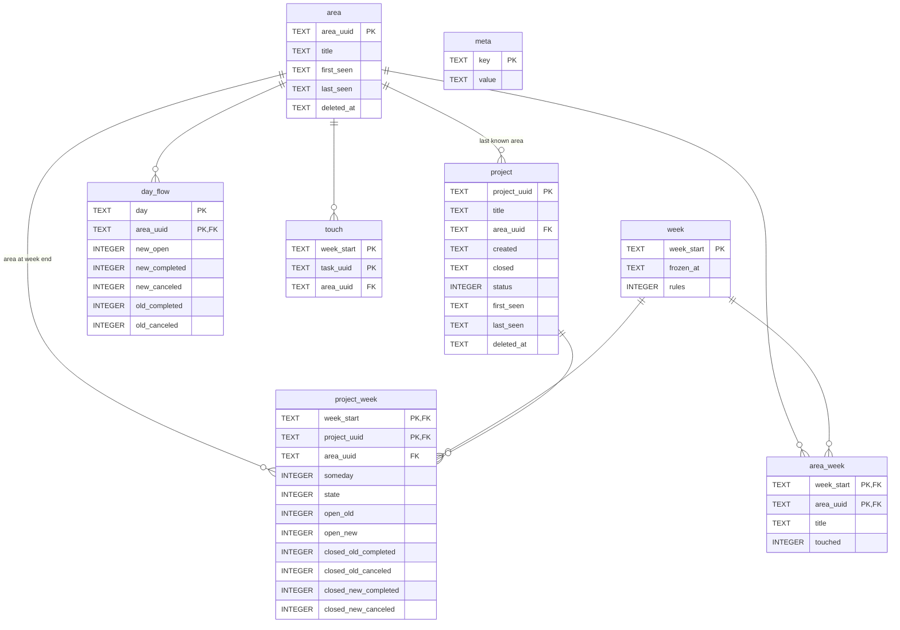

# Weekly history: data schema

## Why

The dashboard is built from the current state of the Things database. Whatever has disappeared from it (deleted areas, projects, tasks after the trash is emptied) disappears from the statistics of past weeks as well. The weekly history records the numbers of a week before the data is gone.

## Principles

- Complete weeks are frozen. At the first refresh after a week ends its rows are written once and never change again. The running week is always computed anew from the Things database.
- First fill: all past weeks from the current database.
- Areas and projects are kept with their last known title; deleting them in Things does not erase them from the dashboard's memory.
- For every frozen week the list of areas is recorded with their titles at the freeze: the wheel of a past week shows the titles as of that date.
- A project is assigned to its last known area. If the area was deleted, the tasks of its projects, including those closed after the deletion, count for the deleted area and not for "Без области" (no area). A task belongs to its own area if it has one, otherwise to the area of its project.

## Schema



`day_flow` is tied to a week by the date, not by a foreign key: a day belongs to the week it falls into. `touch` holds only the weeks that are not in `week` yet.

## Reference tables

```sql
-- Area uuid '' is the "no area" bucket: tasks without a project and an area,
-- and tasks in projects without an area.
CREATE TABLE area (
  area_uuid   TEXT PRIMARY KEY,
  title       TEXT NOT NULL,      -- last known title
  first_seen  TEXT NOT NULL,      -- date of the first export that had it
  last_seen   TEXT NOT NULL,      -- date of the last export that had it
  deleted_at  TEXT                -- first export where it was gone, NULL if alive
);

CREATE TABLE project (
  project_uuid TEXT PRIMARY KEY,
  title        TEXT NOT NULL,
  area_uuid    TEXT NOT NULL REFERENCES area,  -- last known area, see "Last known area"
  created      TEXT NOT NULL,     -- creation date
  closed       TEXT,              -- completion/cancel date, NULL if open
  status       INTEGER NOT NULL,  -- 0 open, 2 canceled, 3 completed (last known)
  first_seen   TEXT NOT NULL,
  last_seen    TEXT NOT NULL,
  deleted_at   TEXT
);

-- Service values; 'export_todos' is the number of to-dos in the last accepted
-- export, used to refuse a broken one; 'touch_since' is the first week the
-- touched to-dos are collected for.
CREATE TABLE meta (
  key    TEXT PRIMARY KEY,
  value  TEXT NOT NULL
);

-- One row per frozen week; a week without a row here is computed live.
CREATE TABLE week (
  week_start  TEXT PRIMARY KEY,   -- Monday, ISO date
  frozen_at   TEXT NOT NULL,      -- when the rows of this week were written
  rules       INTEGER NOT NULL    -- version of the counting rules used
);
```

### Last known area

When an area is deleted, Things moves its projects and tasks to "no area" and clears their `area` field: no reference to the deleted area is left in the database. Only the history can keep the link to the area, from the refreshes made before the deletion.

The rule for `project.area_uuid` at every refresh:
- the record has an area - write it (this also covers a move between areas);
- there is no area, and the previous area is gone from the same export (deleted) -
  keep the previous value;
- there is no area, and the previous area still exists (the record was taken out of
  the area by hand) - write "Без области" (`''`).

A task belongs to its own area if it has one, otherwise to the `project.area_uuid` of its project.

Limitations:
- tasks without a project that sat directly in a deleted area move to "Без области" in all the weeks not frozen yet: the history does not keep their area;
- projects from areas deleted before the history was started stay in "Без области" for good;
- an area created and deleted between two refreshes is never seen by the history.

## Data for the charts

### 1. Closures by weekday, 2. Balance by area, 3. Added and done in the week

One table for all three charts: for every day and area, how many tasks were closed, with those created in the same week and those created earlier kept apart, and how many tasks created that day were still open at the end of the week.

```sql
CREATE TABLE day_flow (
  day            TEXT NOT NULL,     -- ISO date
  area_uuid      TEXT NOT NULL REFERENCES area,
  new_open       INTEGER NOT NULL,  -- created that day, still open at the end of its week
  new_completed  INTEGER NOT NULL,  -- completed that day, created in the same week
  new_canceled   INTEGER NOT NULL,
  old_completed  INTEGER NOT NULL,  -- completed that day, created before that week
  old_canceled   INTEGER NOT NULL,
  PRIMARY KEY (day, area_uuid)
);
```

The charts are sums over it:
- closures by weekday - the closures (`new_*` + `old_*`) of each day over all areas;
- the wheel - the closures of the 7 days of the week for each area;
- the bar - the sums of the week over all days and areas: `new_open` - new and not closed, `new_*` - new and closed, `old_*` - old and closed.

A task is "new" or "old" relative to the week its day falls into (starting on Monday). If the start of the week is changed, the split cannot be recomputed for the frozen days.

Which spokes to draw for a past week and under which titles comes from `area_week`: the areas that existed at the freeze, with the titles they had then. An area deleted later stays in its weeks under its title. `area.title` is only the last known title, for everything else.

```sql
-- Areas as they were when the week was frozen: which spokes the wheel shows
-- for that week and under which titles.
CREATE TABLE area_week (
  week_start  TEXT NOT NULL REFERENCES week,
  area_uuid   TEXT NOT NULL REFERENCES area,
  title       TEXT NOT NULL,     -- title at the freeze
  touched     INTEGER,           -- to-dos touched in the week, NULL if not collected
  PRIMARY KEY (week_start, area_uuid)
);
```

Limitations:
- the weeks of the first fill get today's titles: Things does not keep past titles;
- a week is frozen at the first refresh after it ends; if an area was renamed between the end of the week and that refresh, the week gets the new title.

### Touched tasks

The outer line of the wheel: how many tasks of an area were touched in the week. A touch is the creation, any edit or the closing of a task. Tasks still in the Inbox (open, `start = 0`) are not counted.

Things keeps one modification date per task and overwrites it on every edit, so the touches cannot be counted once at the freeze. They are collected at every refresh:

```sql
-- To-dos touched in the weeks not frozen yet, one row per week and to-do.
CREATE TABLE touch (
  week_start  TEXT NOT NULL,     -- Monday of the week of the touch
  task_uuid   TEXT NOT NULL,
  area_uuid   TEXT NOT NULL REFERENCES area,  -- area at the last observation
  PRIMARY KEY (week_start, task_uuid)
);
```

At every refresh a task outside the Inbox is written into the weeks its creation, closing and last modification dates fall into, if the week is not earlier than `meta.touch_since` and is not frozen yet. The write is an upsert: repeated refreshes do not count a task twice, and the area is taken from the last observation.

When a week is frozen, its rows are folded into `area_week.touched` and deleted from `touch`. Weeks earlier than `touch_since` have `NULL` in `touched`, and the wheel draws only the closures for them. The running week is taken from `touch`.

Limitations:
- an edit is counted only if a refresh happened before the next edit of the same task in another week: the number can be too low, but never too high;
- a task edited and deleted between two refreshes is not counted;
- touches noticed after the week was frozen are dropped.

### 4. Projects of the week

For every week and project the open and closed tasks at the end of the week are kept, with those added in the week and those added earlier kept apart. The area of the project and its Someday flag at the freeze are stored with them.

At present the chart takes the area and Someday from the current state of Things, so for past weeks they may differ from what they were then. In the history they will be as they were, but only for the weeks frozen after the rollout.

```sql
CREATE TABLE project_week (
  week_start      TEXT NOT NULL REFERENCES week,
  project_uuid    TEXT NOT NULL REFERENCES project,
  area_uuid       TEXT NOT NULL REFERENCES area,  -- area at the week end
  someday         INTEGER NOT NULL,               -- 1 if in Someday at the freeze
  state           INTEGER NOT NULL,               -- 0 open, 2 canceled, 3 completed at week end
  open_old        INTEGER NOT NULL,  -- created before the week, open at its end
  open_new        INTEGER NOT NULL,  -- created in the week, open at its end
  closed_old_completed INTEGER NOT NULL,
  closed_old_canceled  INTEGER NOT NULL,
  closed_new_completed INTEGER NOT NULL,
  closed_new_canceled  INTEGER NOT NULL,
  PRIMARY KEY (week_start, project_uuid)
);
```

## Repeated runs and safe writes

A refresh can run several times a day (the button served by `serve.py`, `./refresh.sh`).
The result must not depend on the number of runs.

1. The running week is not written to the database, it is computed from Things anew every time. The exception is `touch`: the observations for the weeks not frozen yet are written there.
2. A week is frozen once, in one transaction:
   - check whether the week is in `week`;
   - if not, write its rows into `day_flow`, `area_week`, `project_week` and a row into `week`, and delete its rows from `touch`;
   - if it is, do nothing.

   The write is a plain `INSERT`, without `OR REPLACE`: a second attempt to write a frozen week caused by a bug in the code hits the primary key and fails.
3. The reference tables (`area`, `project`) are updated by an upsert (`INSERT ... ON CONFLICT DO UPDATE`): `title`, `status`, `last_seen` are overwritten with the same values, `first_seen` is left alone, the areas follow the "Last known area" rule. `deleted_at` is set only if the record is missing from the export and the field is empty, and is cleared if the record shows up again.
4. The export is checked before anything is written to the database: it has tasks, and their number is not less than half of the previous accepted export (`meta.export_todos`). Otherwise the refresh stops without writing. Without this check a failed export on the day of a freeze would write a week of zeros for good and mark all areas and projects as deleted.
